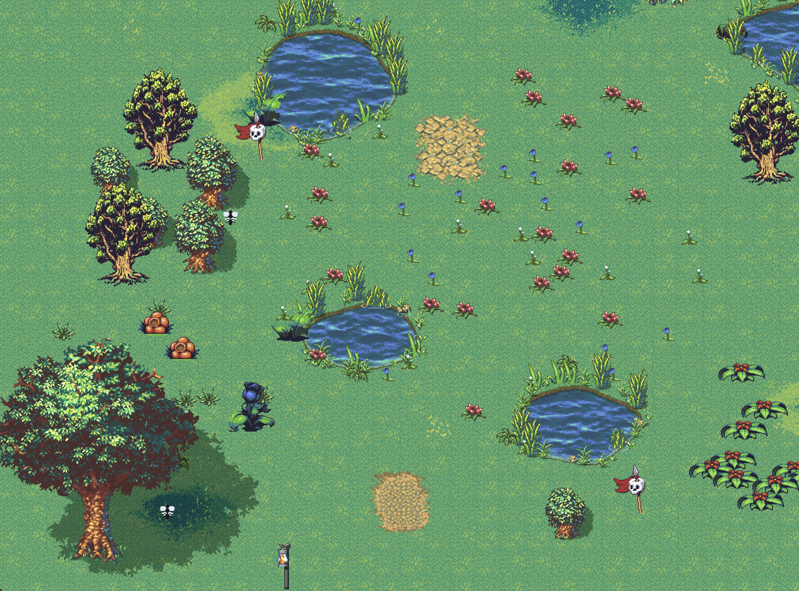
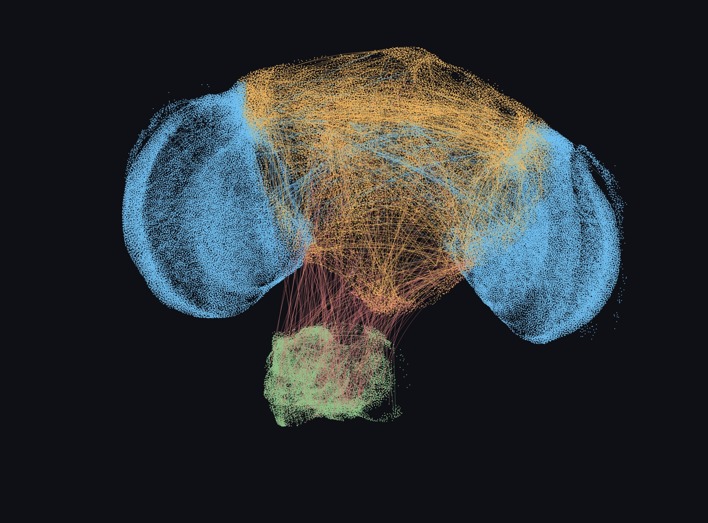

<h1 align="center">microfly</h1>

<p align="center">
  <strong>Real fruit fly connectomes in a tiny arcade world.</strong><br/>
  Spiking brains cut from the male <em>Drosophila</em> CNS, each fly running its own brain in your browser.
</p>

<table>
  <tr>
    <td width="50%" align="center"></td>
    <td width="50%" align="center"></td>
  </tr>
  <tr>
    <td align="center"><sub>The world: flies, flowers, dangers and the live fly panel</sub></td>
    <td align="center"><sub>The brain inspector: an extracted connectome in 3D</sub></td>
  </tr>
</table>

---

## Quick start

The app is plain HTML, CSS and ES modules. There is no build step and nothing to install for the browser. Any static web server works.

### (a) The world with the latest brain (forager)

```bash
cd public
python3 -m http.server 8000
```

Open <http://localhost:8000/?world=world/world-forager.json>.

Six flies start hungry, smell flowers, walk to them, eat, and leave. Pick a fly in the **world** tab to see its action, energy, neuron activity and left/right input and output channels in the **fly** tab. The odour layer toggle in the world tab draws the smell field as a heatmap.

Other worlds on the same server:

| URL                                      | Brain                                        |
| ---------------------------------------- | -------------------------------------------- |
| `/`                                      | `mock`: random toy network                   |
| `/?world=world/world-connectome.json`    | `v0`: smallest functional brain (11 neurons) |
| `/?world=world/world-antennal-lobe.json` | `v0`: antennal-lobe brain (35 neurons)       |
| `/?world=world/world-forager.json`       | `v1`: hungry forager brain (~3,400 neurons)  |

### (b) Simulated brain inspector

With the same server running, open <http://localhost:8000/brains/>.

The inspector loads the `.brain` snapshots listed in [public/brains/brains.json](public/brains/brains.json) and draws each neuron at its real soma position, with its edges. Use the selector to switch between brains, group neurons by annotation level, toggle connections, and hover a neuron to see its identity.

### (c) MaleCNS inspector

[inspector/malecns-3d.html](inspector/malecns-3d.html) is a self-contained 3D view of the whole male CNS dataset. Open it directly in a browser:

```bash
open inspector/malecns-3d.html          # macOS; or double-click the file
```

### Tests and experiments

Requires Node 20+.

```bash
npm test                                 # unit and contract tests
npm run test:slow                        # long-running behaviour tests
node scripts/compare-baseline.mjs --world=world/world-forager.json --seeds=held-out
```

---

## Inspiration

Janelia, Google Research and collaborators have mapped the complete central nervous system of a male fruit fly from electron microscopy: brain *and* ventral nerve cord, over 200,000 reconstructed bodies and hundreds of millions of synapses. Google's post [A connectomics milestone: Mapping the complete male fruit fly brain](https://research.google/blog/a-connectomics-milestone-mapping-the-complete-male-fruit-fly-brain/) tells the story.

microfly asks a simple question: **if you cut a small piece out of that wiring diagram and run it as a spiking network, does the fly do anything useful?**

[malecns.md](malecns.md) is the project's field guide to the dataset (release v1.0, `minconf-0.5`). It covers:

- the 11 Feather files: 211,577 annotated bodies, ~312M synapses in total, ~124M between fully traced neurons;
- the annotation schema: `superclass`, `class`, `type`, `somaSide`, `rootSide`, reconstruction `status`;
- connectivity: edge `weight` is a synapse count, and predicted neurotransmitters give each neuron a sign;
- caveats, and a catalogue of neuron types and what they do.

The dataset itself (~29 GB) is not committed. The extractor reads it from `data/malecns/` or `MALECNS_DIR`.

Obtain the dataset from https://male-cns.janelia.org/download/

---

## How the app works

```text
 world (main thread)                         fly brain (one Web Worker per fly)
 ┌───────────────────────────┐   sense      ┌──────────────────────────────────┐
 │ map, flowers, dangers     │ ───────────► │ input pools (odour L/R, taste L/R)│
 │ odour field, taste        │  inputs[],   │            │                     │
 │ body: energy, hunger      │  hunger      │   LIF network from the connectome │
 │ physics: move, turn, eat  │ ◄─────────── │            │                     │
 └───────────────────────────┘   motor      │ output pools (turn, walk, feed)   │
                                 outputs[]  └──────────────────────────────────┘
```

1. Each tick (20 Hz) the world measures what each fly senses: odour at its left and right antenna, and taste when it stands on a flower. It sends these to the fly's worker with the fly's hunger.
2. The worker drives the brain's input neurons, runs the LIF network for a few steps, and reads the spike rate of the output neurons.
3. The world turns the output rates into motion: walking speed, turning, and feeding. The world never steers the fly. A fly eats only when it is on a flower, nearly stopped, and its feed output is above threshold.

All neural computation is off the main thread, and every run is reproducible from a seed.

### Brains

Select a brain with `flies.brain` in the world config (see [public/world/README.md](public/world/README.md)).

| Brain                         | Version | Size                              | What it is                                                                                                                                                                                                                                                                                  |
| ----------------------------- | ------- | --------------------------------- | ------------------------------------------------------------------------------------------------------------------------------------------------------------------------------------------------------------------------------------------------------------------------------------------- |
| **Mock**                      | `mock`  | 40 neurons                        | A seeded random graph with excitatory and inhibitory neurons. One odour input, left and right motor outputs. A test fixture that checks the LIF core and the worker plumbing before real data is involved ([ADR 001](adrs/001-lif-toy-network-and-fly-integration.md)).                     |
| **Smallest functional brain** | `v0`    | 11 neurons                        | The smallest real subgraph that can drive a fly: one olfactory projection neuron (ALPN) → interneurons → a left and a right descending neuron. Every neuron is a traced body from the dataset ([ADR 002](adrs/002-smallest-functional-brain.md)).                                           |
| **Antennal-lobe brain**       | `v0`    | 35 neurons                        | Same idea with olfactory receptor neurons (ORN) as the entry point, tuned as the best single-input brain. It finds flowers by looping, not by following the odour. Kept as a comparison arm.                                                                                                |
| **Hungry forager**            | `v1`    | ~3,400 neurons, ~205K connections | Bilateral smell and taste pools feed about 2,600 interneurons ranked by information flow. Outputs are the real steering (DNa01, DNa02), forward (DNp09), backward (MDN) and feeding (MN9) neurons. Hunger raises the gain of smell and taste ([ADR 003](adrs/003-hungry-forager-brain.md)). |

On held-out seeds the forager finds a flower in 42% of runs, against 27% for a random walk and 4% for a random network with the same size and weights. Hungry flies find food more often than sated ones. Eating bouts are still short: see [gate-c.md](specs/008-hungry-forager-brain/gate-c.md).

---

## The core algorithm: a leaky integrate-and-fire network

The connectome tells us *who is wired to whom*. To get behaviour out of it, something has to make signals flow through that wiring. In microfly that something is a network of **leaky integrate-and-fire (LIF)** neurons: one LIF neuron per connectome neuron, one weighted connection per connectome edge.

### Why LIF

- **It needs only what the connectome provides.** The dataset gives, for each pair of neurons, a synapse count and a predicted neurotransmitter. It does not give ion channels, dendrite shapes or membrane constants. A LIF neuron needs exactly one number per connection (a signed weight) and a handful of shared constants. More detailed models, such as Hodgkin–Huxley, would need parameters the data does not have, and we would be guessing them for thousands of neurons.
- **Spikes and thresholds matter.** Real neurons are silent until their input crosses a threshold, then fire all-or-nothing, then rest. That non-linearity is what lets a circuit ignore weak noise, pick a side, or switch between walking and feeding. A smooth rate model loses it.
- **It is cheap enough for a browser.** Work is proportional to the number of spikes, not the number of connections. The forager has ~3,400 neurons and ~205K connections, runs 5 steps per world tick at 20 Hz, and there are six flies, each on its own Web Worker.
- **It is transparent.** Every spike can be traced to a neuron with a `bodyId`, and every weight to a synapse count in the dataset. The same seed always gives the same spikes.
- **It has precedent.** A LIF model of the whole female fly brain, built from the FlyWire connectome with the same kind of signed synapse-count weights, predicted real feeding and grooming circuits (Shiu et al. 2024).

### One neuron

Think of each neuron as a leaky bucket. Input pours in, the bucket slowly drains, and when the level reaches a line it empties at once and sends a pulse to every neuron it connects to.

Each neuron `i` has a membrane potential `v[i]`. On every simulation step:

```text
v[i] ← v[i] + (dt/τ)·(v_rest − v[i])      leak: drift back toward rest
             + input[i]                    integrate: spikes that arrived from other neurons
             + external[i]                 integrate: sensory drive (input neurons only)

if v[i] ≥ v_threshold[i]:                  fire
    spike[i] = 1
    v[i] ← v_reset
    stay silent for refractorySteps steps
    for each connection i → j:  input[j] += weight(i→j) × synapticScale   (delivered next step)
```

| Parameter                       | Meaning                                                 | Default | Forager |
| ------------------------------- | ------------------------------------------------------- | ------- | ------- |
| `dt`                            | time per step                                           | 1       | 1       |
| `tau`                           | leak time constant: how long the neuron remembers input | 20      | 20      |
| `vRest`, `vReset`, `vThreshold` | resting level, level after a spike, firing line         | 0, 0, 1 | 0, 0, 1 |
| `refractorySteps`               | silent steps after a spike                              | 2       | 2       |
| `synapticScale`                 | how much potential one unit of weight adds              | 0.2     | 50      |

Spikes are delivered one step later, so the update does not depend on the order neurons are visited, and one synapse costs one step of delay.

### Connections from the connectome

The weight of a connection comes straight from the data:

```text
weight(i→j) = sign(i) × synapses(i→j) / Σ synapses(k→j)     (sum over all inputs k of j)
```

- `sign(i)` is +1 if neuron `i` is predicted to release acetylcholine (excitatory) and −1 for GABA or glutamate (inhibitory). Neurons with other or uncertain transmitters are left out of the brain.
- Dividing by the target's total input means each neuron's inputs add up to at most 1. A neuron with 700 inputs and one with 7 then behave on the same scale. `synapticScale` reads as "the potential added if every input fires at once". At 50, about 2% of a neuron's input synapses firing together is enough to reach threshold.

The small brains use an older rule, `min(synapses, 5) / 5`. The raw synapse counts are stored in every snapshot, so the rule can change without re-reading the dataset.

### Extensions for a large brain

A 3,400-neuron subgraph fed by the plain model above fires in lockstep: everything goes on, then off together. Three optional mechanisms, each grounded in real neurons, fix that. Each is off by default, and with all of them off [lif-v1.js](public/js/brain/lif-v1.js) gives exactly the spikes of [lif-v0.js](public/js/brain/lif-v0.js).

| Mechanism        | Parameters              | What it does                                                                                | Why the forager needs it                                                                                                 |
| ---------------- | ----------------------- | ------------------------------------------------------------------------------------------- | ------------------------------------------------------------------------------------------------------------------------ |
| Synaptic current | `tauSyn`                | A spike's effect is spread over several steps instead of one jump.                          | Smooths the pile-up of thousands of inputs arriving at once.                                                             |
| Adaptation       | `tauAdapt`, `adaptStep` | Each spike adds a little to a slowly decaying brake, `a[i]`, subtracted from the potential. | A constant smell fades, so the brain reacts to *changes* in odour, and a fed fly is not held by the flower it sits on.   |
| Threshold jitter | `thresholdJitter`       | Each neuron's threshold differs slightly, drawn once from the fly's seed.                   | 131 identical receptors with the same drive stop firing in perfect sync, and flies sharing one brain become individuals. |

### Where it sits in the architecture

```text
 .brain snapshot ──► snapshot.js      parse header + CSR arrays (offsets, targets, weights)
                         │
                         ▼
                     lif-v1.js        the network: v, refractory, input, syn, adapt arrays; step()
                         │
                         ▼
                     fly-brain-v1.js  the runner: sensory values → input pools, output pools → drives
                         │
                         ▼
                     fly.worker.js    one Web Worker per fly, speaks the versioned sense/motor protocol
                         │
                         ▼
                     fly-host.js      main thread: owns the workers, sends sense, applies motor to the world
```

- [lif-v1.js](public/js/brain/lif-v1.js) is pure: no DOM, no workers, no hidden constants. It knows nothing about flies. Connections are stored in compressed sparse row (CSR) form, so a spike walks a contiguous slice of `targets` and `weights`.
- [fly-brain-v1.js](public/js/brain/fly-brain-v1.js) is the only place that knows which neurons are senses and which are muscles. The snapshot declares that: each input and output channel lists its neuron indices.
- The experiment scripts call the same runner synchronously, so the browser and the measurements run identical code.

### How a world tick uses it

```text
 world tick (20 Hz)
 1. sense      odour at left and right antenna, taste under the legs, hunger h = 1 − energy
 2. gain       each channel × hunger gain  (smell 0.5 → 1.5, taste 0.1 → 1.5 as h goes 0 → 1)
 3. drive      write the value into external[] for every neuron of that channel's pool
 4. run        lif.step() × stepsPerTick (5), same drive each step
 5. read       per output pool: fraction of its neurons that spiked, smoothed (EMA, 0.05)
               divided by the maximum rate 1 / (refractorySteps + 1) → drive in [0, 1]
 6. act        speed = maxSpeed × (forward − backward)
               turn  = turnRate × (turnLeft − turnRight)
               eat   if on a flower and speed < eatSpeed and feed > feedThreshold
```

| Channel                     | Pool                                                                | Neurons   |
| --------------------------- | ------------------------------------------------------------------- | --------- |
| `odour-left`, `odour-right` | olfactory receptor neurons of six food-odour glomeruli, per antenna | 131 + 131 |
| `taste-left`, `taste-right` | gustatory receptor neurons of the labellum and taste pegs           | 317 + 351 |
| `turnLeft`, `turnRight`     | steering descending neurons DNa01, DNa02                            | 2 + 2     |
| `forward`                   | forward-walking descending neuron DNp09                             | 2         |
| `backward`                  | backward-walking descending neuron MDN                              | 4         |
| `feed`                      | proboscis motor neuron MN9                                          | 2         |

Nothing between the input and output pools is hand-wired. About 2,600 interneurons sit there because synapse counts carry signal from a declared input to a declared output. When an odour is stronger on the left, the left receptor pool fires more, and whether that turns the fly left is decided entirely by the connectome's wiring and signs.

### How the fly adapts, and why

The fly does not learn in the sense of changing its synapses. The weights are fixed by the connectome, because the goal is to test what the wiring alone can do. Behaviour changes over a fly's life through state:

- **Hunger.** Energy drops with time and rises while eating. Hunger `h = 1 − energy` scales the gain on smell and taste inputs, as starvation does in real flies (dopamine on sugar receptors, sNPF on DM1 olfactory receptors). A hungry fly is drawn to food. A sated fly still smells and tastes, but weakly, so it leaves.
- **Adaptation.** The constant smell of the flower a fly sits on fades, so it is not pulled straight back after eating, and a rising odour stands out.
- **Depletion.** Flowers run out of stock and regrow, so flies have to move on.

Learned odour memory is the next step. It lives in the mushroom body (about 4,000 Kenyon cells with dopaminergic teaching signals), which is mostly outside the current brain and needs synaptic plasticity, which the LIF core does not have yet ([ADR 003, Q6](adrs/003-hungry-forager-brain.md#open-questions)).

---

## Project architecture

```text
microfly/
├── public/                    static web app (web root)
│   ├── index.html             the world
│   ├── js/brain/              LIF cores (v0, v1), brain runners, worker, protocol, snapshot reader
│   ├── js/fly/                body, energy, food, stimulus, actions, host that owns the workers
│   ├── js/world/              world composition from JSON: ground, water, shores, scatter, odour field
│   ├── js/render/             canvas renderer, camera, sprites, odour heatmap
│   ├── js/ui/panel/           world/fly tabs, channel bars, neuron map
│   ├── brains/                brain inspector (three.js) and the .brain snapshots
│   ├── world/                 world configs (map, flies, brain choice, experiment seeds)
│   └── assets/                tile atlas and terrain art
├── extract/                   Python extractor: MaleCNS Feather files → .brain snapshots
│   └── configs/               one declarative config per brain
├── inspector/                 standalone 3D viewer of the whole MaleCNS dataset
├── scripts/                   experiments: baseline comparison, calibration, benchmarks
├── tests/                     Node test runner suites (LIF, protocol, snapshots, metrics, behaviour)
├── adrs/                      architecture decisions for each brain
├── specs/                     feature specs, plans, contracts and results
└── malecns.md                 field guide to the dataset
```

Key contracts:

- **Snapshot (`.brain`).** A binary container: a JSON header (provenance, neurons with `bodyId`, type, role and soma position, declared input and output channels, modulators) followed by CSR arrays of targets, weights and raw synapse counts. Format v4 is the forager. v3 files still load.
- **Worker protocol.** `sense` messages carry one value per declared input plus hunger. `motor` messages return one value per declared output, plus activity telemetry for the panel.
- **Capabilities.** A brain declares its channels, and the panel and body adapt to them. A new channel does not need UI changes.

---

## Evolving a brain

A brain is a config file, not code. To grow or tune one:

1. **Change the topology** in [extract/configs/](extract/configs/): add input types (e.g. more olfactory glomeruli in `inputs`), add output pools, or raise the interneuron `budget` for the odour and taste pathways. Larger budgets reach deeper into the connectome. The default (1,500 + 1,500) gives today's ~3,400-neuron brain, and the extractor refuses a result outside `neuronCountRange`.
2. **Re-extract** the snapshot. The extractor is deterministic and fails with a named error code rather than guess:

   ```bash
   cd extract
   python -m venv .venv && .venv/bin/pip install -r requirements.txt
   MALECNS_DIR=../data/malecns .venv/bin/python -m malecns_brain extract \
     --config configs/forager-brain.json --out ../public/brains/forager-brain.brain
   ```

3. **Tune sensitivity** in the world config `flies.brain.lif`: `synapticScale` (how strongly spikes drive targets), `tauAdapt` and `adaptStep` (how quickly a constant input fades), `tauSyn`, `thresholdJitter`, and `stepsPerTick`. Hunger gains on each input are the snapshot's `modulators`.
4. **Measure.** Calibrate on the calibration seeds ([scripts/calibrate-forager.mjs](scripts/calibrate-forager.mjs)), then compare against the random walk and a size-matched random graph on held-out seeds with [scripts/compare-baseline.mjs](scripts/compare-baseline.mjs). Keep a change only if the brain behaves better or more faithfully, and record the run that motivated it.

When a brain fails a behaviour, the fix is a config change, never hand-wiring around the data. A failure is a finding about the subgraph.

---

## References

**Dataset**

- Google Research. [A connectomics milestone: Mapping the complete male fruit fly brain](https://research.google/blog/a-connectomics-milestone-mapping-the-complete-male-fruit-fly-brain/).
- Male CNS connectome, release v1.0 (Janelia FlyEM, Google, and collaborators). Notes in [malecns.md](malecns.md).

**Papers behind the design**

- Semmelhack, J. L. & Wang, J. W. (2009). Select *Drosophila* glomeruli mediate innate olfactory attraction and aversion. *Nature* 459. Food-odour glomeruli for the smell pools (DM1, DM2, DM4, VA2, VM2, DP1m).
- Root, C. M., Ko, K. I., Jafari, A. & Wang, J. W. (2011). Presynaptic facilitation by neuropeptide signaling mediates odor-driven food search. *Cell* 145. Hunger raises olfactory gain.
- Inagaki, H. K. et al. (2012). Visualizing neuromodulation in vivo: TANGO-mapping of dopamine signaling reveals appetite control of sugar sensing. *Cell* 148. Hunger raises taste gain.
- Gordon, M. D. & Scott, K. (2009). Motor control in a *Drosophila* taste circuit. *Neuron* 61. MN9 as the proboscis (feeding) output.
- Bidaye, S. S., Machacek, C., Wu, Y. & Dickson, B. J. (2014). Neuronal control of *Drosophila* walking direction. *Science* 344. MDN, the backward-walking output.
- Bidaye, S. S. et al. (2020). Two brain pathways initiate distinct forward walking programs in *Drosophila*. *Neuron* 108. DNp09, the forward-walking output.
- Rayshubskiy, A. et al. (2020). Neural circuit mechanisms for steering control in walking *Drosophila*. *bioRxiv*. DNa01 and DNa02, the steering outputs.
- Schlegel, P. et al. (2024). Whole-brain annotation and multi-connectome cell typing of *Drosophila*. *Nature* 634. Information-flow ranking, adapted to pick the forager's interneurons.
- Shiu, P. K. et al. (2024). A *Drosophila* computational brain model reveals sensorimotor processing. *Nature* 634. A LIF model of the whole FlyWire connectome: the precedent for running a connectome as a LIF network.
- Gerstner, W., Kistler, W. M., Naud, R. & Paninski, L. (2014). *Neuronal Dynamics*. Cambridge University Press. The LIF neuron, synaptic currents and adaptation.
